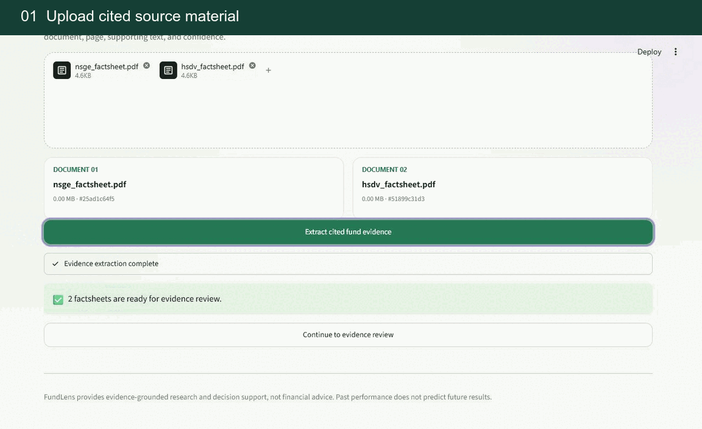
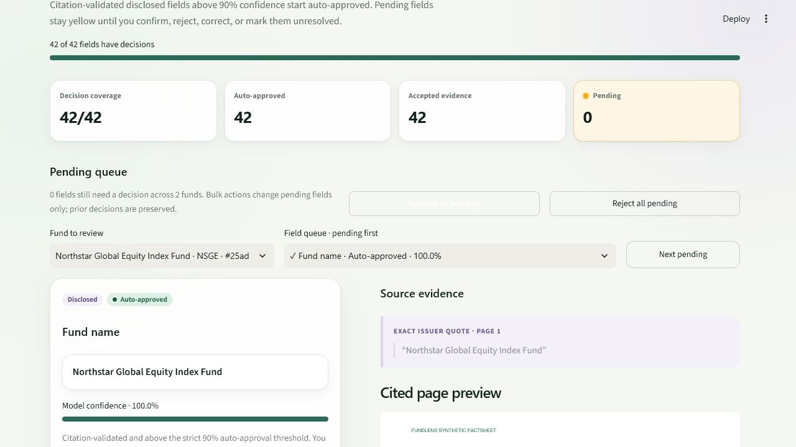
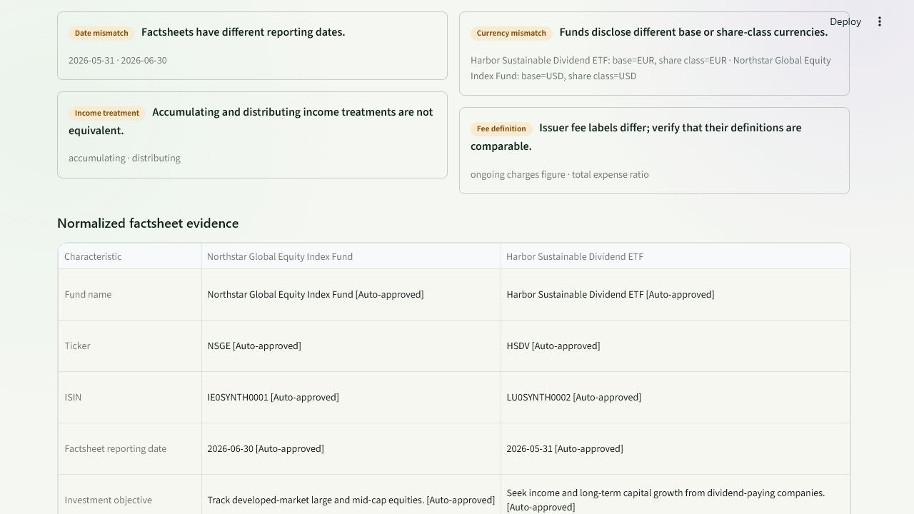
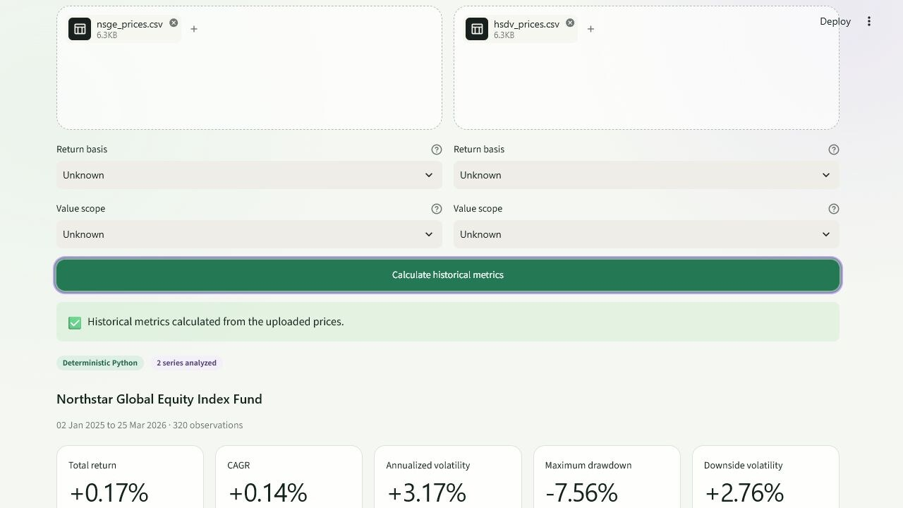
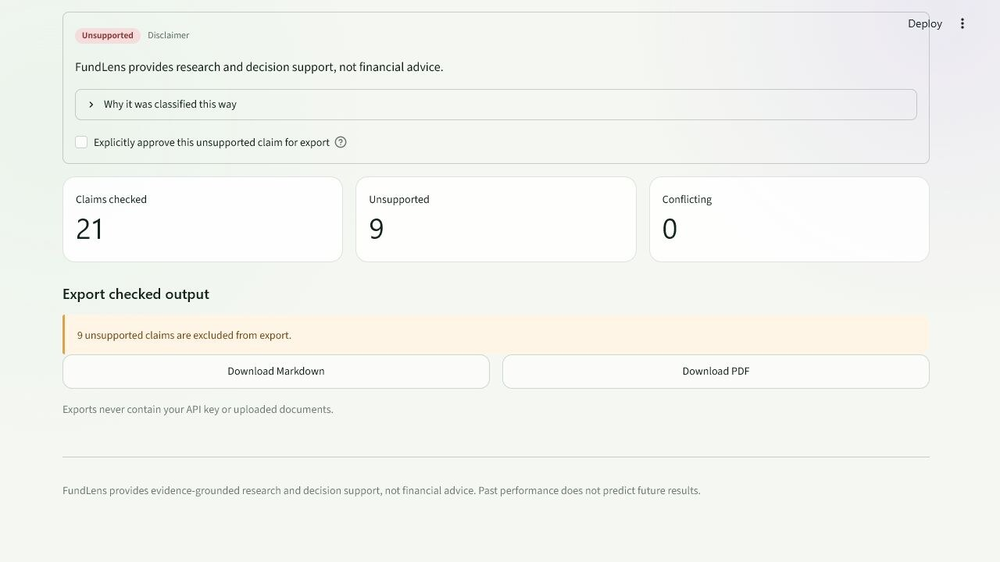
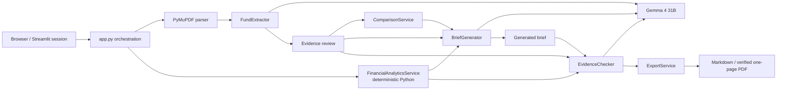

# FundLens

[](https://github.com/ppcdaniel/FundLens/actions/workflows/ci.yml)
[](https://fundlens-research.streamlit.app/)
[](pyproject.toml)
[](LICENSE)

FundLens turns two or three text-based ETF or fund factsheets into a page-cited, reviewable comparison. It adds optional deterministic historical analytics, then generates and evidence-checks a one-page research brief.

[Open the hosted demo](https://fundlens-research.streamlit.app/) - Streamlit may need a minute to wake after inactivity.

> FundLens provides research and decision support, not financial advice. It does not recommend a “best” fund or make buy, sell, or suitability conclusions.

[](https://fundlens-research.streamlit.app/)

<details>
<summary><strong>Open the full-resolution product screens</strong></summary>

| Evidence review | Comparability warnings |
|---|---|
| [](docs/assets/evidence-review.jpg) | [](docs/assets/comparison.jpg) |
| **Reproducible price analytics** | **Claim check and export** |
| [](docs/assets/price-analysis.jpg) | [](docs/assets/claim-check.jpg) |

</details>

## Why FundLens

- **Trace every extracted fact.** Each disclosed value retains its source document, page number, supporting issuer text, and model confidence.
- **Keep review state explicit.** Citation-validated fields above 90% confidence start auto-approved but remain reversible. Pending, rejected, unresolved, and non-disclosed fields are excluded from accepted evidence.
- **Compare without hiding context.** Deterministic checks surface differences in reporting dates, currencies, income treatment, fee terminology, performance periods, return basis, and value scope.
- **Separate language from calculation.** Total return, CAGR, annualized volatility, maximum drawdown, downside volatility, and aligned-return correlations are calculated in Python-not by the language model.
- **Check before export.** Generated claims are classified as document-supported, calculation-supported, interpretation, unsupported, or conflicting evidence. Unsupported claims are excluded unless explicitly approved.

## Workflow

1. **Connect Gemma** with a Google AI Studio API key held in the current Streamlit session.
2. **Upload two or three factsheets** and extract 21 normalized fields with page citations.
3. **Review the evidence** beside the exact issuer quote and cited PDF page.
4. **Compare accepted facts** in a normalized table with deterministic comparability warnings.
5. **Add optional price evidence** from `date,adjusted_close` CSV files.
6. **Frame the decision context**, generate a bounded brief, run the claim-level evidence check, and export Markdown or a verified one-page PDF.

## Try the synthetic demo

All included funds, identifiers, holdings, and prices are fictional and redistributable. A useful first comparison is:

```text
sample_data/synthetic_factsheets/nsge_factsheet.pdf
sample_data/synthetic_factsheets/hsdv_factsheet.pdf

sample_data/prices/nsge_prices.csv
sample_data/prices/hsdv_prices.csv
```

This pair intentionally differs in reporting date, currency, income treatment, and issuer fee terminology, so the comparison can demonstrate several deterministic warning types.

1. Open **AI connection** and enter a Google AI Studio API key.
2. Upload the two PDFs and select **Extract cited fund evidence**.
3. Review or override automatic decisions and resolve any pending fields you want included downstream.
4. Open **Compare** to inspect warnings and normalized evidence.
5. In **Price analysis**, upload the matching CSV for each fund, declare the return basis and value scope if known, and calculate the metrics.
6. In **Brief & export**, save the decision context, choose one of the three tones, generate the brief, and run the evidence check before downloading it.

The complete ten-fund corpus and labeled expected extractions are described in [sample_data/README.md](sample_data/README.md).

## Trust boundary

| Area | Current behavior |
|---|---|
| API key | Streamlit sends the password-field value to the Python server. The application keeps it in that user’s session memory, does not place it in a file or shared cache, and does not include it in exports. **Forget API key** clears FundLens session state and rotates sensitive widgets. |
| PDF extraction | FundLens validates each PDF, parses it in an isolated temporary directory, deletes the temporary copy on exit, and sends bounded extracted page text-not the raw PDF file-to Google for extraction. |
| Structured output | Gemma returns prompt-constrained JSON. FundLens then applies strict Pydantic validation, document identity checks, citation-page checks, and supporting-text verification, with at most one constrained repair attempt. |
| Evidence acceptance | Disclosed fields are accepted downstream only when auto-approved, manually approved, or corrected. Every accepted state remains visible in the UI. |
| Price analytics | Raw price CSVs are processed locally by deterministic Python. Calculated metrics may be supplied to Gemma as evidence for brief generation and checking; Gemma does not calculate them. |
| Brief checking | Claim classification is a second Gemma pass against accepted document evidence and calculated metrics. It reduces risk but does not prove completeness or truth. |
| Export | Unsupported claims are omitted unless explicitly approved. Interpretations and conflicting-evidence claims remain exportable with visible labels. Multi-page PDF output is rejected. |
| Persistence | FundLens has no accounts, database, persistent document store, live-price connection, or application-owned analytics tracker. A hosted operator can still access server memory and platform logs. |

Current limitations include unsupported scanned/image-only PDFs, no OCR, no live prices, no portfolio optimization or forecasts, and no suitability or transaction recommendations. Model access can also depend on the Google API project, region, billing, and quota.

See [PRIVACY.md](PRIVACY.md), [SECURITY.md](SECURITY.md), and [docs/responsible-ai.md](docs/responsible-ai.md) for the complete operating assumptions.

## Run locally with uv

Requirements: Python 3.12 and [uv](https://docs.astral.sh/uv/).

```bash
git clone https://github.com/ppcdaniel/FundLens.git
cd FundLens
uv sync --frozen --all-groups
uv run streamlit run app.py
```

Open `http://localhost:8501` and enter the API key in the application. FundLens does not read an application-owned AI key from `.env` or `secrets.toml`.

Default input limits are:

- two or three PDFs;
- 15 MB and 30 pages per PDF;
- 5 MB per price CSV;
- at least 20 valid price observations.

## Run with Docker

```bash
docker compose up --build
```

Open `http://localhost:8501` and upload the sample files from the cloned repository through the browser.

The Compose configuration runs the application as a non-root user with a read-only root filesystem, an in-memory `/tmp`, and no server-owned AI key.

## Architecture

FundLens is a typed modular monolith. Streamlit owns session orchestration while domain models and services keep parsing, review, comparison, analytics, model access, checking, and export separate.



See [docs/architecture.md](docs/architecture.md) for service boundaries, data lifecycle, failure behavior, and evidence rules.

## Verification

```bash
uv run ruff check .
uv run ruff format --check .
uv run mypy src app.py
uv run pytest
```

Tests inject deterministic model fakes; a live API key is neither required nor used by the test suite.

## Documentation

- [Product scope](docs/product-brief.md)
- [Architecture](docs/architecture.md)
- [Evaluation protocol](docs/evaluation.md)
- [Responsible AI](docs/responsible-ai.md)
- [Privacy](PRIVACY.md)
- [Security](SECURITY.md)
- [Synthetic sample data](sample_data/README.md)

## License

FundLens is available under the [MIT License](LICENSE). The synthetic sample corpus is separately released under [CC0-1.0](sample_data/LICENSE).

FundLens provides evidence-grounded research and decision support, not financial advice. Past performance does not predict future results.
